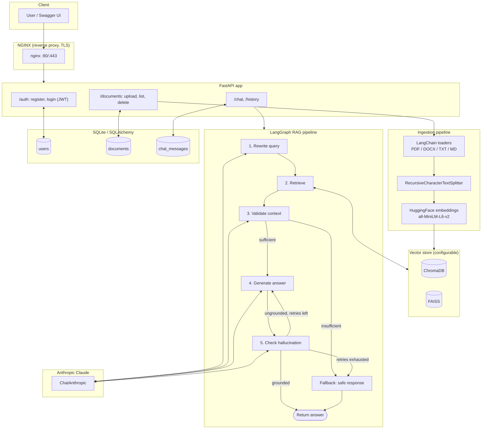

# Enterprise RAG Chatbot

A production-grade, enterprise-style **Retrieval-Augmented Generation (RAG)** chatbot API. Ingests PDF/DOCX/TXT/Markdown documents, indexes them into a configurable vector store (ChromaDB or FAISS), and answers questions through a **LangGraph**-orchestrated pipeline with explicit hallucination checking — all behind a JWT-secured FastAPI backend, containerized with Docker, deployed via GitHub Actions CI/CD to AWS EC2 behind NGINX.

> Built as a portfolio project demonstrating an end-to-end LLM application: ingestion pipeline design, agentic orchestration with LangGraph, prompt engineering to reduce hallucinations, and production deployment practices (Docker, CI/CD, reverse proxy, HTTPS).

---

## Features

- **Multi-format ingestion** — PDF, DOCX, TXT, and Markdown via LangChain document loaders, chunked with `RecursiveCharacterTextSplitter`.
- **Pluggable vector stores** — switch between **ChromaDB** and **FAISS** with a single environment variable (`VECTOR_DB`), no code changes.
- **Local, free embeddings** — HuggingFace `sentence-transformers/all-MiniLM-L6-v2` (no embedding API cost).
- **LangGraph RAG pipeline** with five explicit nodes:
  1. **Query rewriting** — resolves pronouns/context from chat history into a standalone search query.
  2. **Retrieval** — owner-scoped similarity search against the vector store.
  3. **Context validation** — an LLM judges whether retrieved chunks actually contain enough information to answer, *before* spending a generation call.
  4. **Answer generation** — strict, context-grounded prompting; explicitly instructed not to speculate.
  5. **Hallucination checking** — a second LLM pass fact-checks the answer against retrieved context; ungrounded answers are regenerated (bounded retries) or replaced with a safe "I don't know" fallback — **the chatbot never surfaces an unverified answer.**
- **Conversation memory** — per-session history persisted in the database and fed into the rewrite node.
- **JWT authentication** — bcrypt password hashing, scoped per-user documents and chat history (no cross-tenant data leakage).
- **REST API** with auto-generated OpenAPI/Swagger docs at `/docs`.
- **Lightweight demo frontend** at `/ui` — a single static page (vanilla HTML/JS, no build step) for register/login/upload/chat, useful for demos without needing a Swagger form or curl.
- **Dockerized**, deployed behind **NGINX** with a Let's Encrypt/HTTPS bootstrap script.
- **CI/CD** via GitHub Actions: lint + test + Docker build on every push, image publish to GHCR and guarded SSH deploy to EC2 on `main`.
- **Unit + integration test suite** (45 tests) with all LLM/embedding calls mocked — zero network calls or API cost in CI.

---

## Architecture



### Project layout

```
app/
├── main.py, api.py, config.py        # app factory, router aggregation, settings
├── core/                             # logging, exceptions, security (JWT/bcrypt)
├── db/                               # SQLAlchemy models + session
├── auth/                             # /register, /login
├── ingestion/                        # loaders, splitter, ingestion pipeline
├── embeddings/                       # HuggingFace embeddings factory
├── vectorstore/                      # Chroma/FAISS implementations + factory
├── rag/                              # LangGraph state, nodes, prompts, graph
├── memory/                           # DB-backed conversation memory
├── documents/                        # /upload, /documents, /documents/{id}
└── chat/                             # /chat, /history
tests/                                 # unit + integration tests (pytest)
deploy/                                # nginx config, EC2 deploy script, certbot bootstrap
.github/workflows/                     # ci.yml, cd.yml
```

---

## Setup

### Prerequisites

- Python 3.12+
- An [Anthropic API key](https://console.anthropic.com/) (for the LLM)
- Docker + Docker Compose (for containerized run)

### Local development

```bash
git clone https://github.com/Akash6700882/RAG-Chatbot.git
cd RAG-Chatbot

python -m venv .venv
source .venv/bin/activate        # Windows: .venv\Scripts\activate

pip install -r requirements.txt

cp .env.example .env
# Edit .env and set ANTHROPIC_API_KEY and JWT_SECRET_KEY

uvicorn app.main:app --reload
```

Visit **http://localhost:8000/** for the demo frontend, or **http://localhost:8000/docs** for interactive Swagger UI.

### Running tests

```bash
pytest -q          # 45 tests, all LLM/embedding calls mocked — no API key needed
ruff check app tests
```

### Configuration reference (`.env`)

| Variable | Default | Description |
|---|---|---|
| `LLM_PROVIDER` | `anthropic` | `anthropic`, `gemini`, or `groq` — pick whichever provider you have credits/quota for |
| `ANTHROPIC_API_KEY` / `ANTHROPIC_MODEL` | — / `claude-haiku-4-5` | Used when `LLM_PROVIDER=anthropic` |
| `GEMINI_API_KEY` / `GEMINI_MODEL` | — / `gemini-2.0-flash` | Used when `LLM_PROVIDER=gemini` (free tier via Google AI Studio) |
| `GROQ_API_KEY` / `GROQ_MODEL` | — / `llama-3.1-8b-instant` | Used when `LLM_PROVIDER=groq` (free tier via console.groq.com) |
| `EMBEDDING_MODEL` | `sentence-transformers/all-MiniLM-L6-v2` | HuggingFace embedding model |
| `VECTOR_DB` | `chroma` | `chroma` or `faiss` |
| `VECTOR_DB_PATH` | `./data/vectorstore` | Persistence directory |
| `UPLOAD_DIR` | `./data/uploads` | Raw uploaded file storage |
| `CHUNK_SIZE` / `CHUNK_OVERLAP` | `1000` / `150` | Text splitter tuning |
| `JWT_SECRET_KEY` | — | **Change in production** |
| `JWT_ACCESS_TOKEN_EXPIRE_MINUTES` | `60` | Token lifetime |
| `DATABASE_URL` | `sqlite:///./data/app.db` | Swap for Postgres in production |
| `RETRIEVAL_TOP_K` | `4` | Chunks retrieved per query |
| `MAX_GENERATION_RETRIES` | `2` | Regeneration attempts before falling back |
| `CONVERSATION_HISTORY_TURNS` | `6` | Turns of memory fed into query rewriting |

---

## API documentation

Full interactive docs are generated automatically at `/docs` (Swagger) and `/redoc`, and the raw schema is at `/openapi.json`. Summary:

| Method | Path | Auth | Description |
|---|---|---|---|
| `POST` | `/api/v1/auth/register` | — | Create an account |
| `POST` | `/api/v1/auth/login` | — | Returns a JWT bearer token |
| `POST` | `/api/v1/upload` | Bearer | Upload + ingest a PDF/DOCX/TXT/MD file |
| `GET` | `/api/v1/documents` | Bearer | List your ingested documents |
| `DELETE` | `/api/v1/documents/{id}` | Bearer | Delete a document (DB row, file, vector chunks) |
| `POST` | `/api/v1/chat` | Bearer | Ask a question; runs the LangGraph RAG pipeline |
| `GET` | `/api/v1/history` | Bearer | Retrieve conversation history (optional `?session_id=`) |
| `GET` | `/health` | — | Liveness check |

Example flow:

```bash
# Register + login
curl -X POST localhost:8000/api/v1/auth/register -H "Content-Type: application/json" \
  -d '{"email":"you@example.com","password":"supersecret1"}'

TOKEN=$(curl -s -X POST localhost:8000/api/v1/auth/login -H "Content-Type: application/json" \
  -d '{"email":"you@example.com","password":"supersecret1"}' | jq -r .access_token)

# Upload a document
curl -X POST localhost:8000/api/v1/upload -H "Authorization: Bearer $TOKEN" \
  -F "file=@data/sample_docs/employee_handbook.md"

# Ask a question
curl -X POST localhost:8000/api/v1/chat -H "Authorization: Bearer $TOKEN" \
  -H "Content-Type: application/json" \
  -d '{"message":"How many PTO days carry over each year?"}'
```

---

## Docker usage

```bash
cp .env.example .env   # set ANTHROPIC_API_KEY, JWT_SECRET_KEY

docker compose up -d --build
```

This starts two containers:
- **`api`** — the FastAPI app (multi-stage build; CPU-only torch to keep the image lean), not published to the host directly.
- **`nginx`** — the single public entrypoint, reverse-proxying to `api` over the internal Docker network, listening on `:80` (and `:443` once TLS is enabled).

```bash
curl http://localhost/health
open http://localhost/docs
```

To enable HTTPS once you own a domain pointed at your host:

```bash
./deploy/nginx/init-letsencrypt.sh api.yourdomain.com you@example.com
# then uncomment the HTTPS server block in deploy/nginx/rag-chatbot.conf
# and: docker compose restart nginx
```

---

## AWS deployment

The intended production topology is a single EC2 instance running Docker + Docker Compose, fronted by NGINX (as above), with images published to GitHub Container Registry (GHCR):

1. Provision an EC2 instance (Ubuntu, Docker + Docker Compose installed), open ports 80/443.
2. Clone this repo to `/opt/rag-chatbot` on the instance and create its `.env`.
3. `docker compose up -d` once manually to confirm it comes up healthy.
4. Add repo secrets (see CI/CD below) so future pushes to `main` auto-deploy via `deploy/ec2/deploy.sh`, which pulls the new image, retags it, and reloads the compose stack with a health-check gate.
5. Point DNS at the instance and run `init-letsencrypt.sh` for HTTPS.

---

## CI/CD workflow

Two GitHub Actions workflows:

- **`ci.yml`** (every push/PR to `main`): installs dependencies, runs `ruff check`, runs the full `pytest` suite (45 tests, no real API calls), and does a Docker build check.
- **`cd.yml`** (every push to `main`): builds and pushes the image to `ghcr.io/<owner>/rag-chatbot:<sha>` and `:latest`, then attempts an SSH deploy to EC2 via `deploy/ec2/deploy.sh`. The deploy step checks for `EC2_HOST` / `EC2_SSH_KEY` repo secrets first and skips with a clear log message if they aren't set yet — so CD stays green even before AWS access is wired up.

To enable real EC2 deploys, add these repository secrets (Settings → Secrets and variables → Actions):

| Secret | Description |
|---|---|
| `EC2_HOST` | Public IP/hostname of the EC2 instance |
| `EC2_SSH_KEY` | Private key with SSH access to the instance |
| `EC2_USER` | *(optional, defaults to `ubuntu`)* SSH user |

---

## Screenshots

> _Add screenshots here once deployed — e.g. Swagger UI (`/docs`), a sample `/chat` response, and the GitHub Actions run history._

- `docs/screenshots/swagger-ui.png` — Swagger UI overview
- `docs/screenshots/chat-example.png` — Example `/chat` request/response
- `docs/screenshots/ci-cd-run.png` — Passing GitHub Actions run

---

## Design notes

- **Why LangGraph over a plain chain?** The hallucination-check → retry loop is a genuine graph (conditional edges, bounded cycles), which a linear chain can't express cleanly. It also makes each stage of the pipeline independently testable.
- **Why validate context *before* generating?** Skipping generation entirely when retrieval is empty/irrelevant avoids wasting an LLM call on a question the documents can't answer, and guarantees a safe fallback instead of a plausible-sounding guess.
- **Why is retrieval owner-scoped?** Every chunk is tagged with `owner_id` at ingestion time and filtered at retrieval time, so multi-tenant deployments never leak one user's documents into another user's answers.
- **Why ChromaDB *and* FAISS?** They represent two common production choices (managed-feeling persistent store vs. lightweight in-process index); the vector store factory pattern shows the abstraction can support either without touching ingestion or retrieval code.
