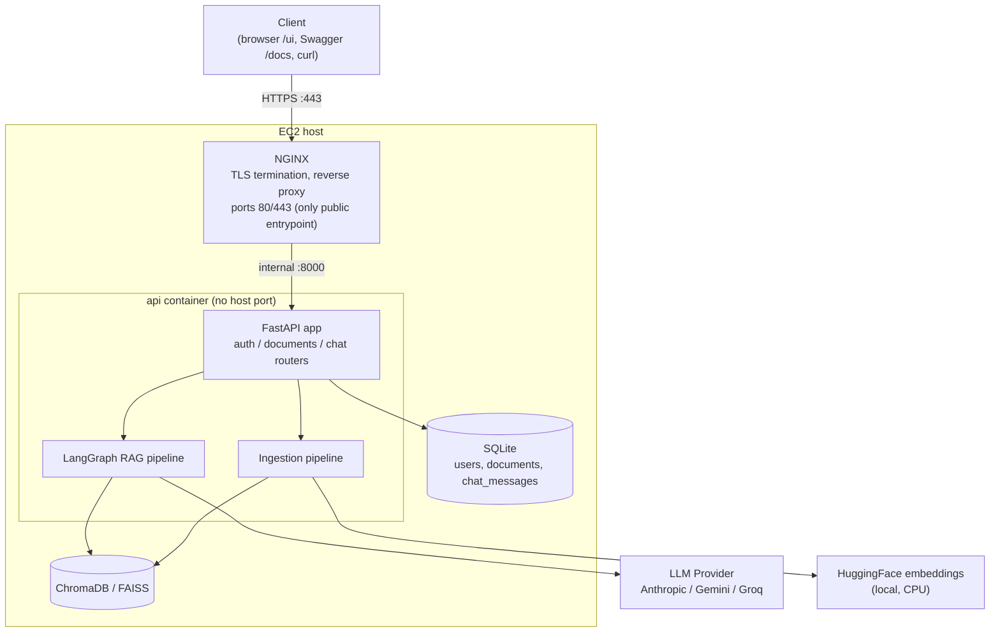

# System Overview

```mermaid
flowchart TB
    Client["Client<br/>(browser /ui, Swagger /docs, curl)"]

    subgraph Edge["EC2 host"]
        Nginx["NGINX<br/>TLS termination, reverse proxy<br/>ports 80/443 (only public entrypoint)"]

        subgraph AppContainer["api container (no host port)"]
            FastAPI["FastAPI app<br/>auth / documents / chat routers"]
            RAG["LangGraph RAG pipeline"]
            Ingest["Ingestion pipeline"]
        end

        VectorDB[("ChromaDB / FAISS")]
        SQLite[("SQLite<br/>users, documents, chat_messages")]
    end

    LLM["LLM Provider<br/>Anthropic / Gemini / Groq"]
    HF["HuggingFace embeddings<br/>(local, CPU)"]

    Client -- HTTPS :443 --> Nginx
    Nginx -- internal :8000 --> FastAPI
    FastAPI --> RAG
    FastAPI --> Ingest
    Ingest --> HF
    Ingest --> VectorDB
    RAG --> VectorDB
    RAG --> LLM
    FastAPI --> SQLite
```
