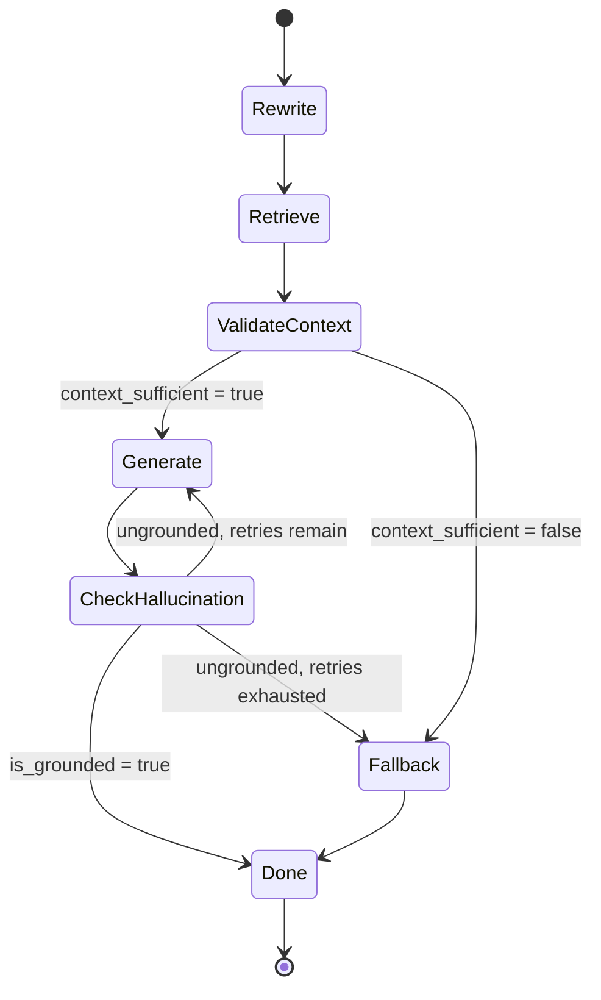

# RAG / LangGraph Workflow

## Node responsibilities

| Node | LLM call? | Purpose |
|---|---|---|
| Rewrite | Conditional (skipped on turn 1) | Resolve pronouns/context from chat history into a standalone query |
| Retrieve | No | Owner-scoped similarity search against the vector store |
| ValidateContext | Conditional (skipped if nothing retrieved) | Judge whether retrieved chunks can actually answer the question |
| Generate | Yes | Produce a strictly-grounded answer, citing sources |
| CheckHallucination | Yes | Fact-check the generated answer against the same context |
| Fallback | No | Fixed, honest "I don't have enough information" response; sets `used_fallback` |
