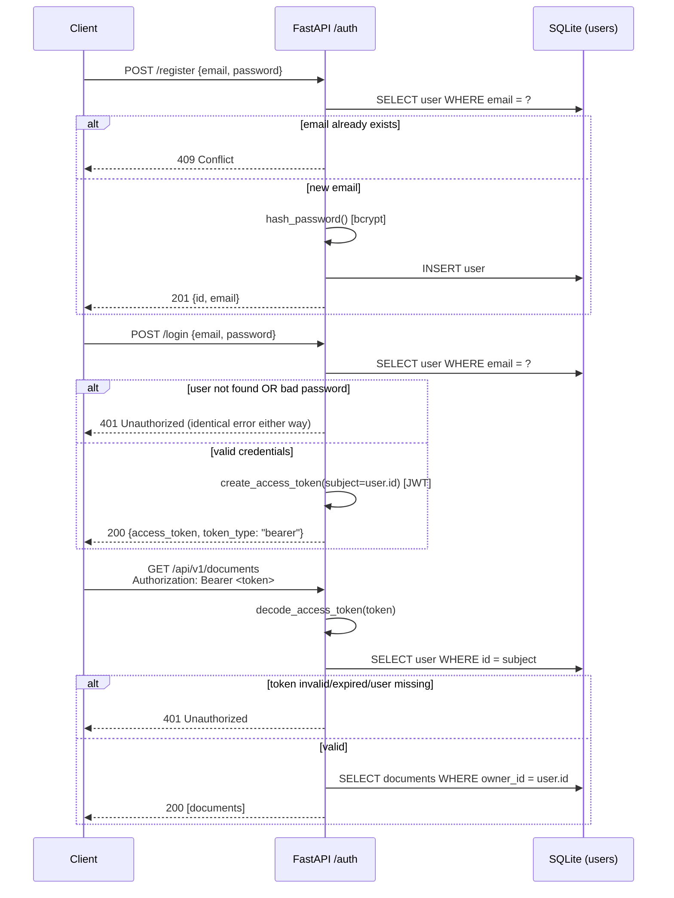

# Authentication Flow

```mermaid
sequenceDiagram
    participant C as Client
    participant A as FastAPI /auth
    participant DB as SQLite (users)

    C->>A: POST /register {email, password}
    A->>DB: SELECT user WHERE email = ?
    alt email already exists
        A-->>C: 409 Conflict
    else new email
        A->>A: hash_password() [bcrypt]
        A->>DB: INSERT user
        A-->>C: 201 {id, email}
    end

    C->>A: POST /login {email, password}
    A->>DB: SELECT user WHERE email = ?
    alt user not found OR bad password
        A-->>C: 401 Unauthorized (identical error either way)
    else valid credentials
        A->>A: create_access_token(subject=user.id) [JWT]
        A-->>C: 200 {access_token, token_type: "bearer"}
    end

    C->>A: GET /api/v1/documents<br/>Authorization: Bearer <token>
    A->>A: decode_access_token(token)
    A->>DB: SELECT user WHERE id = subject
    alt token invalid/expired/user missing
        A-->>C: 401 Unauthorized
    else valid
        A->>DB: SELECT documents WHERE owner_id = user.id
        A-->>C: 200 [documents]
    end
```
