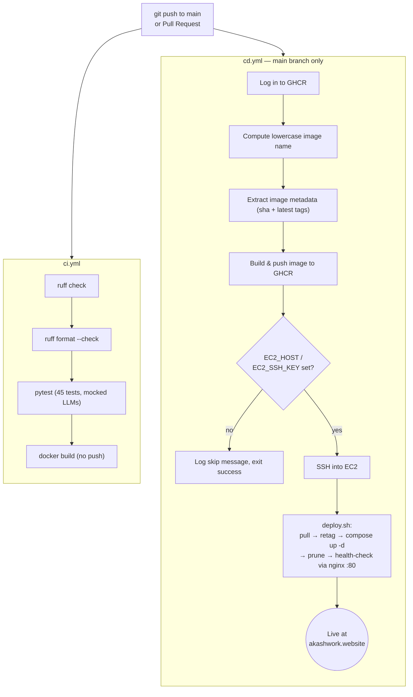

# CI/CD Pipeline

```mermaid
flowchart TD
    Push["git push to main<br/>or Pull Request"]

    subgraph CI["ci.yml"]
        direction TB
        Lint["ruff check"] --> Format["ruff format --check"]
        Format --> Test["pytest (45 tests, mocked LLMs)"]
        Test --> DockerCheck["docker build (no push)"]
    end

    subgraph CD["cd.yml — main branch only"]
        direction TB
        Login["Log in to GHCR"] --> Lower["Compute lowercase image name"]
        Lower --> Meta["Extract image metadata (sha + latest tags)"]
        Meta --> Build["Build & push image to GHCR"]
        Build --> CheckSecrets{"EC2_HOST /<br/>EC2_SSH_KEY set?"}
        CheckSecrets -- no --> Skip["Log skip message, exit success"]
        CheckSecrets -- yes --> SSH["SSH into EC2"]
        SSH --> DeployScript["deploy.sh:<br/>pull → retag → compose up -d<br/>→ prune → health-check via nginx :80"]
        DeployScript --> Live(("Live at<br/>akashwork.website"))
    end

    Push --> CI
    Push --> CD
```
