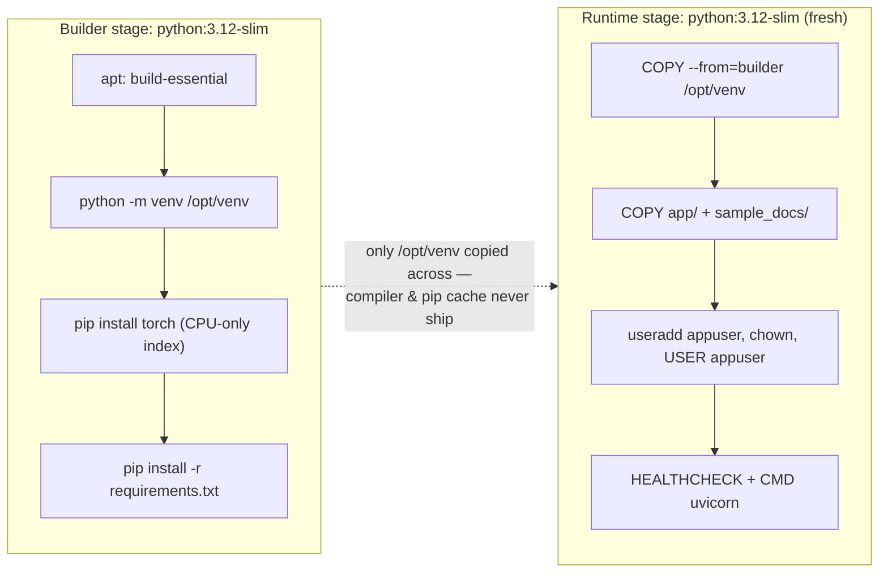
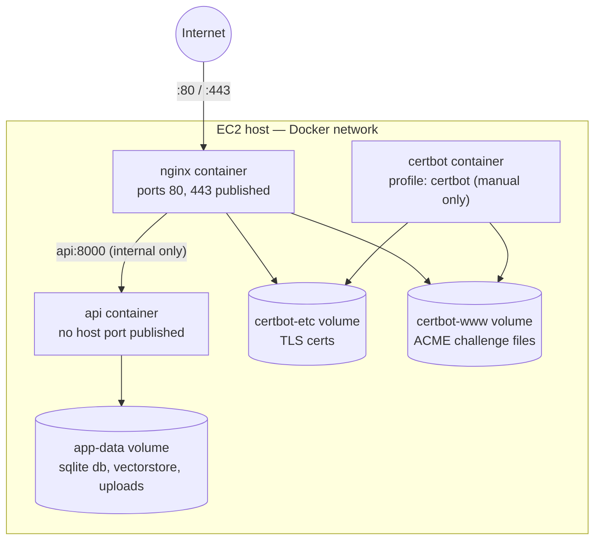

# Docker Architecture

## Multi-stage build

```mermaid
flowchart LR
    subgraph Builder["Builder stage: python:3.12-slim"]
        B1["apt: build-essential"] --> B2["python -m venv /opt/venv"]
        B2 --> B3["pip install torch (CPU-only index)"]
        B3 --> B4["pip install -r requirements.txt"]
    end

    subgraph Runtime["Runtime stage: python:3.12-slim (fresh)"]
        R1["COPY --from=builder /opt/venv"] --> R2["COPY app/ + sample_docs/"]
        R2 --> R3["useradd appuser, chown, USER appuser"]
        R3 --> R4["HEALTHCHECK + CMD uvicorn"]
    end

    Builder -. "only /opt/venv copied across —<br/>compiler & pip cache never ship" .-> Runtime
```

## Compose topology

```mermaid
flowchart TB
    Internet(("Internet"))

    subgraph Host["EC2 host — Docker network"]
        Nginx["nginx container<br/>ports 80, 443 published"]
        API["api container<br/>no host port published"]
        Certbot["certbot container<br/>profile: certbot (manual only)"]

        Vol1[("app-data volume<br/>sqlite db, vectorstore, uploads")]
        Vol2[("certbot-etc volume<br/>TLS certs")]
        Vol3[("certbot-www volume<br/>ACME challenge files")]
    end

    Internet -- ":80 / :443" --> Nginx
    Nginx -- "api:8000 (internal only)" --> API
    API --> Vol1
    Nginx --> Vol2
    Certbot --> Vol2
    Nginx --> Vol3
    Certbot --> Vol3
```
