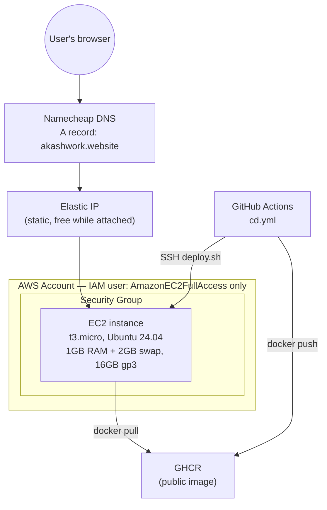
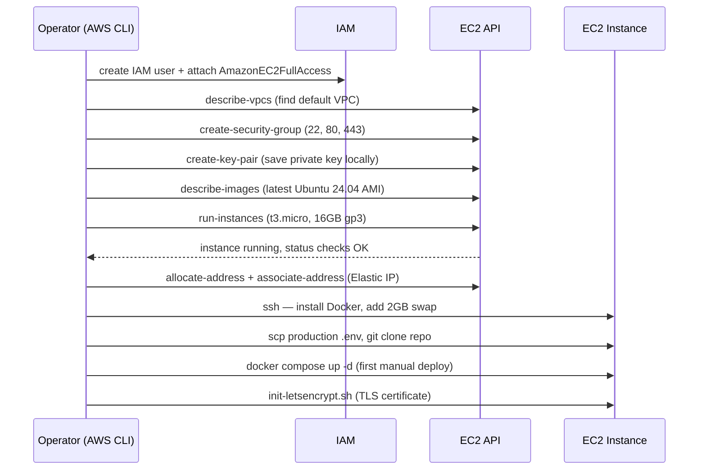

# AWS Deployment Architecture

```mermaid
flowchart TB
    User(("User's browser"))
    DNS["Namecheap DNS<br/>A record: akashwork.website"]
    EIP["Elastic IP<br/>(static, free while attached)"]

    subgraph AWS["AWS Account — IAM user: AmazonEC2FullAccess only"]
        subgraph SG["Security Group<br/>inbound: 22, 80, 443 only"]
            EC2["EC2 instance<br/>t3.micro, Ubuntu 24.04<br/>1GB RAM + 2GB swap, 16GB gp3"]
        end
    end

    GHCR["GHCR<br/>(public image)"]
    GitHub["GitHub Actions<br/>cd.yml"]

    User --> DNS --> EIP --> EC2
    GitHub -- "docker push" --> GHCR
    GitHub -- "SSH deploy.sh" --> EC2
    EC2 -- "docker pull" --> GHCR
```

## Provisioning sequence (as actually run, via AWS CLI)

```mermaid
sequenceDiagram
    participant Ops as Operator (AWS CLI)
    participant IAM as IAM
    participant EC2 as EC2 API
    participant Host as EC2 Instance

    Ops->>IAM: create IAM user + attach AmazonEC2FullAccess
    Ops->>EC2: describe-vpcs (find default VPC)
    Ops->>EC2: create-security-group (22, 80, 443)
    Ops->>EC2: create-key-pair (save private key locally)
    Ops->>EC2: describe-images (latest Ubuntu 24.04 AMI)
    Ops->>EC2: run-instances (t3.micro, 16GB gp3)
    EC2-->>Ops: instance running, status checks OK
    Ops->>EC2: allocate-address + associate-address (Elastic IP)
    Ops->>Host: ssh — install Docker, add 2GB swap
    Ops->>Host: scp production .env, git clone repo
    Ops->>Host: docker compose up -d (first manual deploy)
    Ops->>Host: init-letsencrypt.sh (TLS certificate)
```
