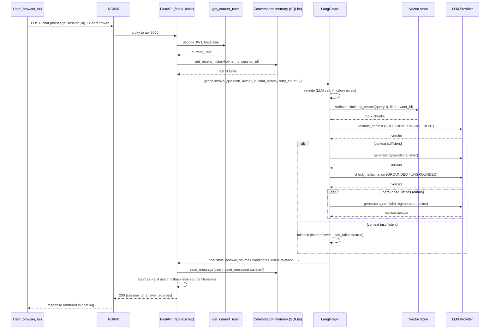

# End-to-End Request Sequence: `/chat`

```mermaid
sequenceDiagram
    participant U as User (browser, /ui)
    participant N as NGINX
    participant F as FastAPI (/api/v1/chat)
    participant Auth as get_current_user
    participant Mem as Conversation memory (SQLite)
    participant G as LangGraph
    participant V as Vector store
    participant L as LLM Provider

    U->>N: POST /chat {message, session_id} + Bearer token
    N->>F: proxy to api:8000
    F->>Auth: decode JWT, load User
    Auth-->>F: current_user
    F->>Mem: get_recent_history(owner_id, session_id)
    Mem-->>F: last N turns

    F->>G: graph.invoke({question, owner_id, chat_history, retry_count:0})

    G->>G: rewrite (LLM call, if history exists)
    G->>V: retrieve: similarity_search(query, k, filter owner_id)
    V-->>G: top-k chunks
    G->>L: validate_context (SUFFICIENT / INSUFFICIENT)
    L-->>G: verdict

    alt context sufficient
        G->>L: generate (grounded answer)
        L-->>G: answer
        G->>L: check_hallucination (GROUNDED / UNGROUNDED)
        L-->>G: verdict
        opt ungrounded, retries remain
            G->>L: generate again (with regeneration notice)
            L-->>G: revised answer
        end
    else context insufficient
        G->>G: fallback (fixed answer, used_fallback=true)
    end

    G-->>F: final state {answer, sources candidates, used_fallback, ...}
    F->>Mem: save_message(user), save_message(assistant)
    F->>F: sources = [] if used_fallback else source filenames
    F-->>N: 200 {session_id, answer, sources}
    N-->>U: response rendered in chat log
```
